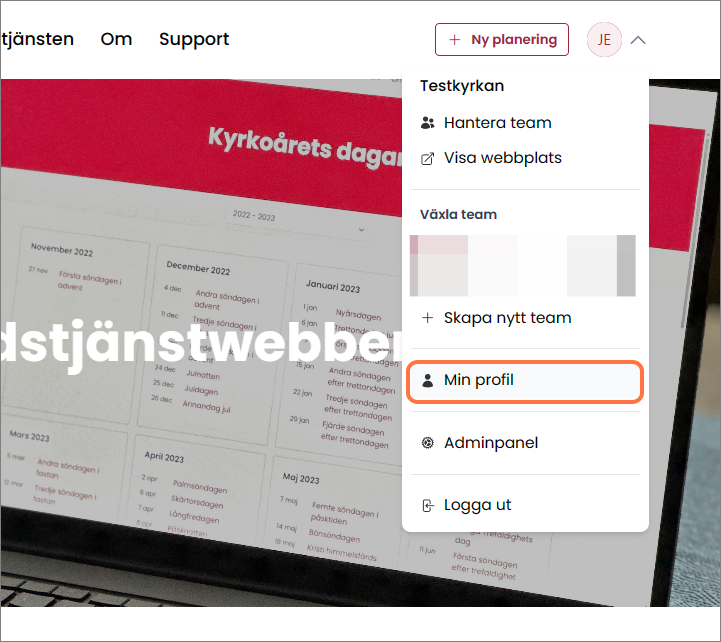

# Din användarprofil

För att se och uppdatera inställningarna på din användarprofil väljer du "Min profil" i användarmenyn.

### 1. Öppna användarmenyn genom att klicka på den i webbsidans övre högra hörn.

### 2. Klicka på "Min profil".

### 3. Sidan för din profil

På sidan för din användarprofil kan du uppdatera din personliga profil, hantera dina team och skapa nya team.

### 4. Profilinformation

Här kan du uppdatera namn och e-postadress.

:::tip OBS! Tänk på att om du byter e-postadress måste du använda den nya e-postadressen när du loggar in.
:::

Du kan ladda upp en personlig profilbild genom att klicka på "Välj ett nytt foto" och ladda upp ett foto.

När du är klar trycker du på knappen spara.

### 5. Uppdatera lösenord

Om du vill uppdatera ditt lösenord fyller du i ditt nuvarande lösenord samt det nya du vill byta till. Det nya behöver du skriva i både rutan "Nytt lösenord" och "Bekräfta lösenordet".

När du är klar trycker du på knappen Spara.

### 6. Aktivera Tvåfaktorsautentisering (2FA)

Med tvåfaktorsautentisering (2FA) får du en extra säkerhet eftersom det behövs två steg för att logga in. Om någon kommer åt ditt användarnamn och lösenord, kan personen ändå inte logga in eftersom det behövs en extra separat bekräftelse i ytterligare ett steg.

2FA är inte aktiverat som standard, se [Aktivera Tvåfaktorsautentisering](docs/komma-igang/tva-faktor) för instruktioner.

### 7. Logga ut alla andra enheter

Om du vill logga ut från alla andra enheter där du är inloggad kan du göra det genom att klicka "Logga ut andra webbläsarsessioner.

Det här är bra att göra om du loggat in på ditt konto på någon annans dator och är osäker på om du loggade ut eller inte.

### 8. Radera ditt konto

Om du vill ta bort ditt konto permanent klickar du "Radera konto" och följer instruktionerna.

OBS! Ett raderat konto kan inte återskapas.

 