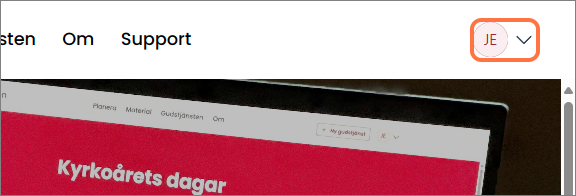
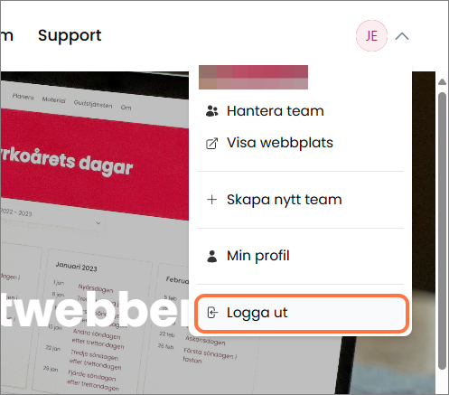
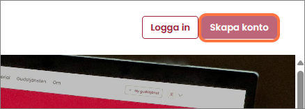

# Logga ut

Logga ut från Gudstjänstwebben genom att klicka på "Logga ut" i användarmenyn.

### 1. Öppna användarmenyn genom att klicka på den i webbsidans övre högra hörn.

### 2. Klicka på "Logga ut"

### 3. När du ser knapparna "Logga in" och "Skapa konto" vet du att du är utloggad.

 
