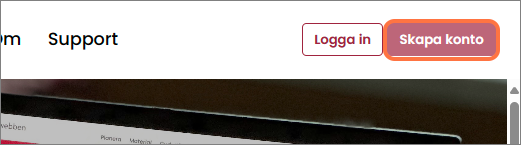
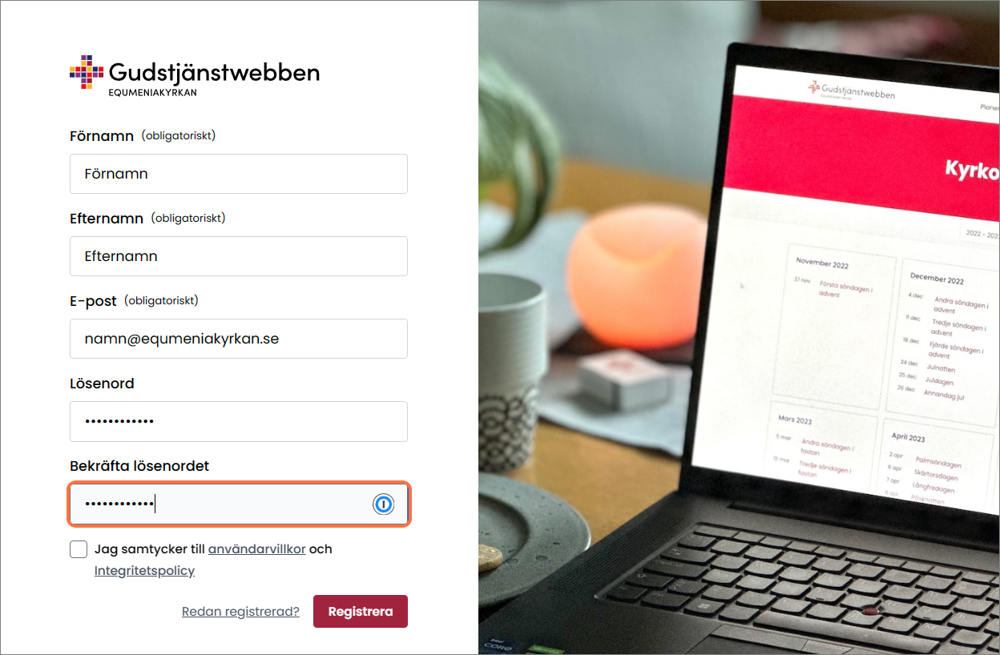
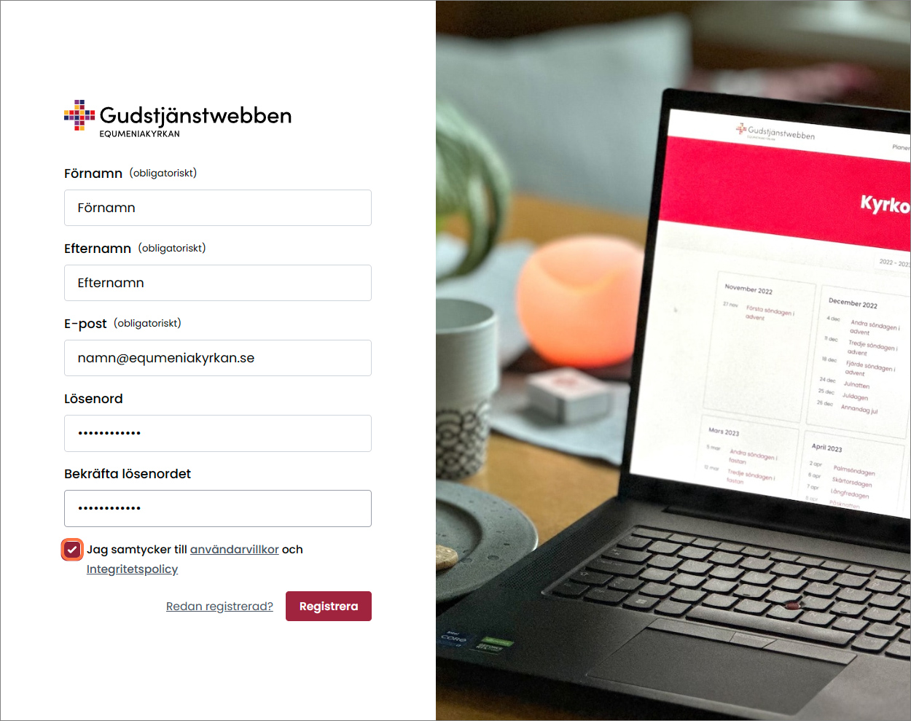
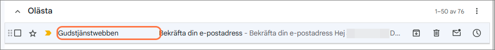
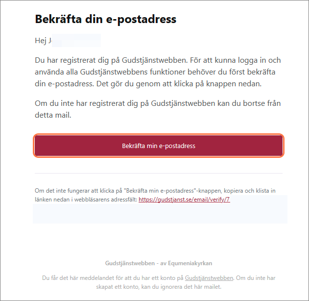
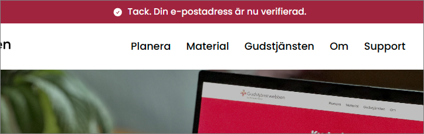

# Skapa ett konto

**Du kan använda Gudstjänstwebben utan att registera dig och logga in på ett konto. Men med ett konto blir den bättre och mer personlig.**

När du är inloggad kan du bland annat favoritmarkera material och mallar, planera dina gudstjänster och andakter i planeringsverktyget, och även spara och dela med dig av det du gör till andra.

### 1. Klicka på knappen "Skapa konto" i övre högra hörnet.

### 2. Fyll i dina uppgifter.

Fyll i förnamn, efternamn och din e-postadress.

Välj ett bra och säkert lösenord. (Minst 8 tecken) och skriv in det i rutorna "Lösenord" och "Bekräfta lösenordet".

### 3. Klicka i rutan "Jag samtycker till användarvillkor och Integritetspolicy".

### 4. Klicka på knappen "Registrera".

### 5. Verifiera e-postadressen
Innan du kan använda gudstjänstwebben fullt ut behöver du verifiera din e-postadress. Det gör du via det mail som skickas till den e-postadress du angett när du skapade kontot.

Obs! Länken för bekräftelsen är giltig i 60 minuter.

### 6. Starta ditt e-postprogram och klicka på mailet från Gudstjänstwebben.

### 7. Klicka på knappen "Bekräfta min e-postadress".

### 8. Webbsidan gudstjanst.se öppnas i din webbläsare och texten "Tack. Din e-postadress är nu verifierad" visas längst upp på sidan.

 
