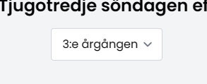

# Kyrkoårets söndagar
**På gudstjänstwebben hittar du kyrkoårets alla söndagar strukturerade efter år, månad och datum. Varje kyrkoårssöndag visar söndagens namn, tema, bibeltexter och rekommenderad musik, böner och annat material.**

## Hitta kyrkoårets söndagar
Du hittar kyrkoårets söndagar på *Gudstjänstwebbens startsida* och på sidan *Gudstjänsten*. Där kan du se de närmast kommande söndagarna med datum, namn och tema.

[BILD]

Genom att klicka på en söndag får du upp en sida med mer information om den aktuella kyrkoårssöndagen.

Om du klickar på knappen `Se hela kyrkoåret` får du upp årets alla söndagar. Där kan du välja år och se vilken månad och datum en kyrkoårssöndag inträffar. Även här kan du klicka på en söndag för att få upp mer information om den aktuella söndagen.

## Kyrkoårssöndagen
Varje söndag under kyrkoåret har en egen sida där vi samlat information om den aktuella söndagen.

**Sidan innehåller tre delar**
- Datum och årgång för söndagen olika år
- Söndagens bibeltexter baserat på årgång
- Material som passa söndagen (sånger, böner med mera)

## Växla årgång
Som standard visas årets aktuella årgång och bibeltexter. Klicka på årgångsrutan om du vill se bibeltexterna för en annan årgång.

## Passande och utvalt material
För varje söndag under kyrkoåret finns utvalt och passande material. Det handlar om sång och musik, böner, drama och annat material.

Längst ner på kyrkoårssöndagens sida hittar du kurerat och utvalt material från materialbanken som passar extra bra för den aktuella kyrkoårssöndagen.

Gudstjänstwebbens projektgrupp arbetar hela tiden tillsammans med teologer, musiker och andra anställda inom kyrkan och lägger hela tiden upp nytt material.

Du hanterar och filtrerar materialet på samma sätt som i materialbanken.

[Bild kurerat material]