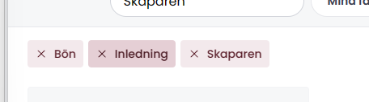

# Söka och filtrera i materialbanken
**Materialbanken innehåller väldigt mycket material och att bläddra fram sida för sida kan vara inspirerande men samtidigt väldigt tidskrävande. Därför finns en kraftfull funktion för att söka och filtrera materialet**

## Sök
Klicka i sökrutan och skriv ett sökord som passar det material du letar efter.

**Sökfunktionen letar bland annat i**
- Materialets titel
- Materialets beskrivning
- Sångtexter
- Namn på länkar och filer
- Kategori, tillfälle och moment
- Källor

## Filtrera
Klicka på en filterknapp, t.ex. kategori och välj en eller flera kategorier. Materialbanken filtreras och visar bara det material som är kategoriserade med någon av de aktuella kategorier.

**Alla filter**
Om du vill ha möjlighet att filtrera på fler saker än kategori, moment och tillfälle klickar du på `Alla filter`. I filterpanelen som visas kan du välja bland alla filter som materialet är kategoriserat med.

**Du kan filtrera på:**
- **Mina favoriter** - Det material du favoritmarkerat (Kräver inloggning)
- **Kategori** - Bibeltext, bön, gemensam sång, samtalsfrågor, välsignelse ...
- **Moment** - Gudstjänstens moment som t.ex. inledning, bibelläsning, kollekt, gemensam sång, predikan, bön ...
- **Tillfällen** - Gudstjänst, andakt, dop, barnvälsignelse, begravning, konfirmation ... 
- **Typ av material** - Text, noter, video, bild, ljud, podcast
- **Söndagar & helgdagar** - Kyrkoårets söndagar och andra tillfällen under kyrkoåret
- **Källor** - Källan materialet är hämtat från. Psalmer och Sånger, Bibel 2000, Brukssånger, David Media ...
- **Språk** - Materialets språk
- **Personer** - Upphovsperson eller författare
- **Händelser** - Viktiga händelser under året som t.ex insamlingar, nationella och internationella dagar och annat som är bra att veta när man gör en planering.

## Kombinera sök och filter
Du kan kombinera både sökord och flera olika filter för att förfina din sökning.

## Ta bort en sökning eller filtrering
Alla sökord och valda filter visas som rutor längst upp på sidan. För att "stänga av" ett filter eller sökord klickar du på krysset i rutan för det aktuella filtret/sökordet.

